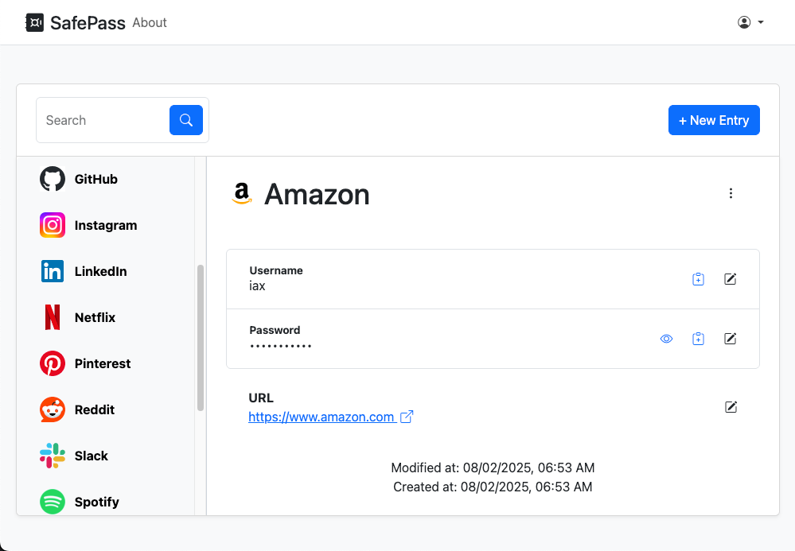

# SafePass



**SafePass** is a simple and secure password manager that allows you to store your passwords in an encrypted database file.

## Features

- Secure password storage with encryption
- User-friendly interface
- Fast search and retrieval of credentials
- Built with Ruby on Rails 8 and Hotwire

## Getting Started

### Prerequisites

- Ruby 3.4
- Rails 8.x
- SQLite3
- Node.js 22.x & Yarn

### Installation

1. Clone the repository:

   ```sh
   git clone git@github.com:iax7/safepass.git
   cd safepass
   ```

2. Install dependencies:

   ```sh
   bundle install
   yarn install
   ```

3. Set up the database:

   ```sh
   rails db:setup
   ```

4. Start the server:

   ```sh
   bin/dev
   ```

5. Visit `http://localhost:3000` in your browser.

## Credits

This project is part of the [Ruby on Rails 8 and Hotwire: Build a Password Manager](https://www.udemy.com/course/ruby-on-rails-8-and-hotwire-build-a-password-manager/) course.

Related Project: [SafePass Extension](https://github.com/iax7/safepass-extension)
